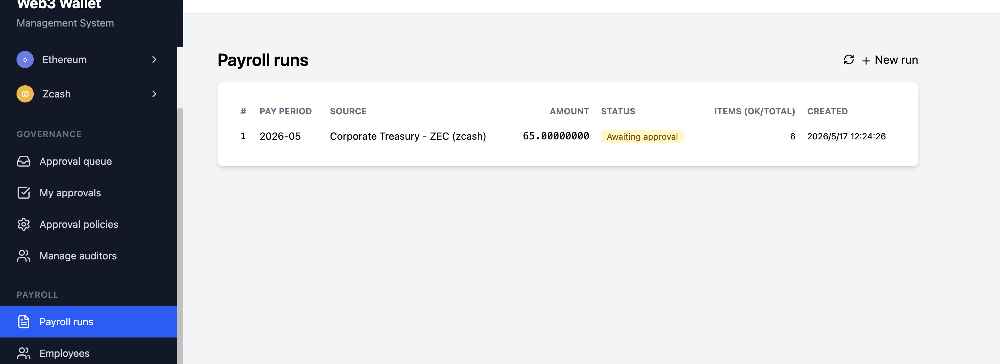
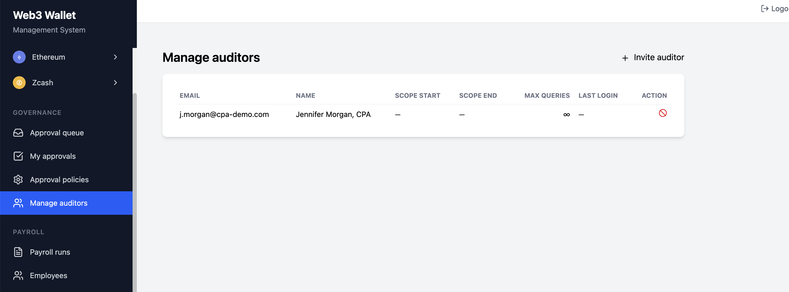
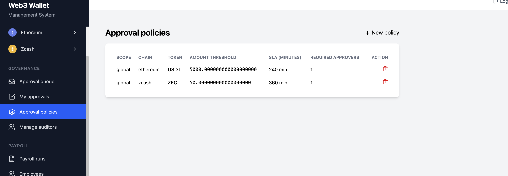
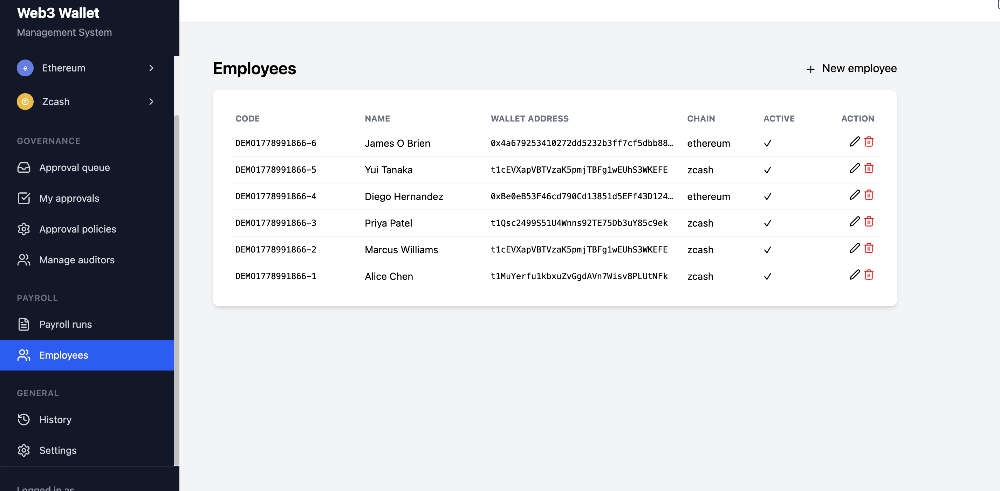

[English](README.md) | [中文](README_CN.md)

# zPay Enterprise

> **面向 Web3 的隐私金融操作系统**
> 多链托管钱包 · 双签财务管控 · 批量发薪 · 监管级审计 — 自托管单一服务一站搞定。

[](LICENSE)
[](CHANGELOG.md)
[](https://www.rust-lang.org)
[](CONTRIBUTING.md)
[](SECURITY.md)

zPay Enterprise 让企业在公链上转账 / 发薪 / 留 audit trail，但**像传统银行一样可控**——不用把私钥交给第三方托管，不用搞 multisig 仪式，也不用自己搭审计管道。**一个自托管服务**就包了：多链钱包托管（以太坊 + Zcash Orchard 隐私交易）、按策略走的双签审批、批量发薪、按需出审计师可下载的披露报告。



---

## 🎉 v0.3.0 发布要点 — M1 企业版（2026 年 6 月）

M1 第一波正式发布。三大业务能力叠加在已有 M0 多链钱包内核之上，加上端到端自动烟测 + 双语运营手册。**所有 M0 老调用 0 改动继续可用。**

### 🔐 F1.1 — Viewing Key 审计与披露
独立的**审计师角色**+ 独立登录入口 + 独立 JWT（`kind=auditor`）—— 管理员 token 泄露也碰不到审计接口，反之亦然。**OVK / IVK / UFVK** 三种 viewing key 一键导出，UFVK 是标准的 ZIP-316 `uview...` 串，可以直接粘进 Zashi 或任何兼容的 viewing-only 钱包验证。**ZIP-307 启发的披露报告**支持 PDF / CSV / JSON 三格式，按钱包 + 时间窗 + 季度配额受限。 → [PRD-F1.1](docs/public/PRD-F1.1.md)



### 🛡 F2.1 — Maker-Checker 双签审批
**审批策略**按 `范围 × 链 × 币种 × 金额阈值 × SLA` 配置。`发起人 ≠ 审批人`**在 SQL 层强制**，前端 RBAC 漏掉也兜得住。`POST /transfers` 命中阈值自动进 `awaiting_approval` 状态，**5 分钟扫一次的 SLA worker** 自动把超期请求标 expired，永远不会卡死 maker。拒绝必须填理由（≥ 5 字符）。 → [PRD-F2.1](docs/public/PRD-F2.1.md)



### 💰 F3.1 — 批量发薪
员工花名册 + CSV 导入 + **两阶段校验**（客户端 + 服务端）。每条 item 真链上 Orchard fan-out。F2.1 阈值 hook 让大额月度发薪进**一次整批审批**而不是 N 次单笔审批。部分失败单条重试，卡在 `executing` 状态的 run 也能强制取消恢复。 → [PRD-F3.1](docs/public/PRD-F3.1.md)



### 📐 运维与 DX
- **端到端烟测脚本** — 1 条 shell 跑 11 步 × 34 条断言（打包发布时附带）。
- **双语用户手册** — [English](docs/USER-MANUAL-EN.md) · [中文](docs/USER-MANUAL-CN.md)，按**角色和业务场景**组织，不按 feature 散排。
- **30 分钟 staging 部署食谱** — [STAGING-DEPLOYMENT.md](docs/STAGING-DEPLOYMENT.md) 把一台干净 Linux 机器变成 HTTPS live 部署。

完整 per-area 改动清单：[CHANGELOG.md](CHANGELOG.md)。

---

## 🎯 谁在用 zPay

zPay 围绕 Web3 公司里**真正在转移资金的 4 类人**来设计：

### CFO / 财务总监
*"我每月要把 ZEC 和 USDT 发给供应商和员工。任何一个人都不能单独把钱卷走。季度末审计师要看清我们到底做了什么。"*

→ 给超阈值的支出配 maker-checker 策略；月度 CSV 上传走批量发薪；季度末给审计师发只读 scoped 登录。**私钥永远不出你的服务器。**

### 财务运营负责人 (Treasury / Operations)
*"我配策略，但不亲自审批每一笔交易。我想要一个 dashboard 看清谁在等什么、SLA 还有多久、哪批发薪需要关注。"*

→ 按 `链 × 币种 × 阈值 × SLA` 配审批策略。盯着审批队列。卡死的 run 强清。团队涨规模就调阈值——后端 forward-only 同步不破坏老逻辑。

### 外部审计师（Big-4 / 区域 CPA）
*"客户给我个登录账号。我要不接触私钥就核实 Q1 上链历史，最后还要带几份 PDF 进我审计底稿。"*

→ 走独立 `/auditor/login`（admin token 在这里被物理拦截）。看客户授权给你的、且在时间窗内的钱包。生成披露 PDF —— 每条交易**带一个 revealed nullifier 锚到 Zcash 链**，独立可验证不需要信任我们后端。

### DevOps / 安全负责人
*"我要部署上线，不想自己变成 key-custody 创业公司。要 HTTPS 单服务 + 加密落盘 + 自动化测试 + 应急响应方案。"*

→ 单一 Rust binary + MySQL + Zebra full node（全 Docker）。AES-256-GCM 加密落盘。双 JWT 物理隔离。`e2e/smoke.sh` 覆盖所有 M1 路径。letsencrypt 自动续签见[部署文档](docs/STAGING-DEPLOYMENT.md)。漏洞披露走 [SECURITY.md](SECURITY.md)。

---

## ✨ 核心能力

### 多链钱包托管
- **以太坊**（原生 + ERC-20: USDT / USDC / DAI / WETH）+ **Zcash**（透明 + Orchard 屏蔽）。
- 私钥用 **AES-256-GCM** 加密落盘——磁盘上永远不是明文，导出需要二次输入 admin 密码做 fresh intent 校验。
- 可配 RPC 端点 + fallback；以太坊 EIP-1559 gas 估算。
- 可扩展：实现 `ChainClient` trait 就能加新链。

### Zcash Orchard 隐私
- 全 **4 种转账模式**：T→T、T→Z（屏蔽）、Z→Z（全隐私）、Z→T（解屏蔽）。
- **Halo 2** 零知识证明，无 trusted setup。
- ZIP-317 费用结构；ZIP-316 unified address 解析；ZIP-307 启发的披露 body。
- 后台 Orchard 同步，按钱包独立追踪进度。

### 企业财务管控（M1）
- **审批策略** `范围 × 链 × 币种 × 阈值 × SLA`，按最具体优先匹配。
- `发起人 ≠ 审批人` SQL 层强制 —— 前端 RBAC bug 也绕不开。
- **SLA worker** 5 分钟扫一次过期 `awaiting_approval` 行，永远不会让审批卡死。
- **批量发薪** + CSV 上传 + 两阶段校验 + 单条重试 + 卡死 run 强清。

### 审计与合规（M1）
- **独立审计师角色**配独立 JWT（`kind=auditor`）—— admin 接口和审计师接口物理隔离。
- **按钱包授权 + 时间窗 + 披露配额**：审计师只看授权给他的、只看授权期内的、最多看 N 次。
- **Viewing Key 导出**走标准 ZIP-316 `uview...` 串 —— 审计师可在 Zashi 钱包独立验证。
- **披露报告** PDF / CSV / JSON 三选一；range 区间接 ISO 8601 时间戳，服务端自动转换成 block height。

### 国际化
- 所有 UI 字符串都走 i18n key；中英文 locale 在 `frontend/src/locales/`。

---

## 🛡 安全与合规要点

| 领域 | 实现 |
|---|---|
| **私钥存储** | AES-256-GCM 加密落盘，磁盘永不明文 |
| **Key 导出** | 二次输入 admin 密码（fresh intent），下载 token 消耗后审计记录仍保留 |
| **JWT 隔离** | Admin JWT（`kind=user`）+ Auditor JWT（`kind=auditor`）—— SQL 层路由互不可达 |
| **审批强制** | `WHERE initiated_by <> viewer_user_id` 是数据库约束，不是前端 check |
| **拒绝规范** | 审批人 reject 必须填理由 ≥ 5 字符 |
| **SLA 规范** | 5 分钟 worker 自动把过期 `awaiting_approval` 翻 `expired`，防永久卡死 |
| **CORS** | 显式 `ALLOWED_ORIGIN` 白名单；wildcard 启动时直接拒绝 |
| **限流** | `/auth/login` 按 peer IP 走 governor 限流 |
| **披露可追溯** | 每条披露 entry 含 **revealed nullifier** 锚到 Zcash 链 —— 审计师不用信任我们后端就能独立验证 |
| **Forward-only 迁移** | Schema 增量列全 nullable；M0 老调用升级不破 |

完整漏洞披露策略见 [SECURITY.md](SECURITY.md)。

---

## 🚀 5 分钟快速跑（Docker）

```bash
git clone https://github.com/robustfengbin/zpay-enterprise.git
cd zpay-enterprise
cp backend/.env.example .env
docker compose up --build
```

- Backend 跑在 `http://localhost:8080`。
- 首次启动时缺失的 secret（`WEB3_SECURITY__ENCRYPTION_KEY` / `WEB3_JWT__SECRET` / `WEB3_SECURITY__ADMIN_INITIAL_PASSWORD`）会自动生成并写入 `backend/.env.secrets`（chmod 0600，已 gitignore）。
- **务必备份 `backend/.env.secrets`** —— 这个文件丢了 = 所有加密钱包永久无法解锁。
- 生产环境必须设 `WEB3_SERVER__ALLOWED_ORIGIN` 为前端确切 origin，未设则服务直接拒启。

完整 setup 走读：[QUICKSTART.md](QUICKSTART.md) · 生产级部署：[STAGING-DEPLOYMENT.md](docs/STAGING-DEPLOYMENT.md)

---

## 📚 文档地图

| 文档 | 受众 | 用途 |
|---|---|---|
| [README.md](README.md) | All | 产品概览 + 发布要点 (English) |
| [README_CN.md](README_CN.md)（本文件） | 中文用户 | 产品概览 + 发布要点（中文） |
| [QUICKSTART.md](QUICKSTART.md) | 开发者 | 5 分钟 Docker 本地跑通 |
| [docs/STAGING-DEPLOYMENT.md](docs/STAGING-DEPLOYMENT.md) | 运维 | 干净 Linux → HTTPS live 部署（~30 分钟） |
| [docs/USER-MANUAL-EN.md](docs/USER-MANUAL-EN.md) | CFO / auditor / operator | English operations manual by role |
| [docs/USER-MANUAL-CN.md](docs/USER-MANUAL-CN.md) | 财务 / 审计师 / 操作员 | 按角色 + 业务场景组织的中文操作手册 |
| [docs/public/PRD-F1.1.md](docs/public/PRD-F1.1.md) | 工程师 / 合作伙伴 | Viewing Key 审计 + 披露 spec |
| [docs/public/PRD-F2.1.md](docs/public/PRD-F2.1.md) | 工程师 / 合作伙伴 | Maker-checker 审批 spec |
| [docs/public/PRD-F3.1.md](docs/public/PRD-F3.1.md) | 工程师 / 合作伙伴 | 批量发薪 spec |
| [docs/product-roadmap-2026.md](docs/product-roadmap-2026.md) | 投资人 / 客户 | 年度路线图（English） |
| [docs/product-roadmap-2026-cn.md](docs/product-roadmap-2026-cn.md) | 投资人 / 客户 | 年度路线图（中文） |
| [docs/zcash-enterprise-use-cases.md](docs/zcash-enterprise-use-cases.md) | 销售 | 8 个详细企业 use case（中文） |
| [docs/orchard_privacy_transfer_architecture.md](docs/orchard_privacy_transfer_architecture.md) | 工程师 | Orchard 同步 / witness / fan-out 内部架构 |
| [CHANGELOG.md](CHANGELOG.md) | All | 按 release 的详细改动列表 |
| [SECURITY.md](SECURITY.md) | 安全研究员 | 漏洞披露策略 |
| [CONTRIBUTING.md](CONTRIBUTING.md) | 贡献者 | Dev 环境 / 代码规范 / PR 指南 |

---

## 🛣 路线图（2026）

我们在搭建 **Web3 企业级隐私金融基础设施** —— 第一个让企业在公链上转移资金、同时具备传统银行级隐私 + 安全 + 控制的平台。

| 季度 | 主题 | 关键交付 |
|---|---|---|
| **Q1** | 企业可靠性 | 端到端交易追踪 / 自动 failover / 实时 dashboard（M0 基线） |
| **Q2** | 合规与治理 | **Maker-checker / 审计角色 / ZIP-307 披露 / 批量发薪** —— v0.3.0 M1（本次发布 ✅） |
| **Q3** | 大流量隐私 | 优化 Orchard 同步 / 单 tx 多 output fan-out / 大额转账 / 统一余额管理 |
| **Q4** | 隐私金融平台 | 开发者 SDK / 多链 treasury / HSM / KMS 集成 / Webhook fan-out |

完整愿景文档：[docs/product-roadmap-2026-cn.md](docs/product-roadmap-2026-cn.md) · [English](docs/product-roadmap-2026.md)

---

## 🧩 技术栈

**后端** — Rust · Actix-web 4 · SQLx (MySQL 8) · librustzcash (Orchard 0.13 / Halo 2) · ethers-rs · printpdf · AES-256-GCM · JWT

**前端** — React 19 · TypeScript · Vite · Tailwind CSS · i18next · React Router 7

**运维** — Docker Compose · PM2 · nginx（SPA cache + 反代）· letsencrypt（certbot）

---

## 🎯 8 个详细企业场景

zPay 对应到具体企业工作流，详细 API 示例见 use case 专属指南：

1. **加密货币支付网关** — 电商接 ZEC + USDT 收款，带隐私
2. **企业财务管理** — 职责分离 + audit log + 多签工作流
3. **OTC 大宗交易** — 保密大额 Z→Z 交易 + 对手方隐私
4. **隐私优先交易所** — 客户屏蔽存款 + 自动余额对账
5. **跨境汇款** — 多链结算（ETH 求速度，ZEC 求隐私）
6. **机构托管** — 按客户分户钱包 + 给审计师 view-only key
7. **供应链金融** — 保密的供应商付款 + 选择性向监管披露
8. **批量发薪** — 走策略 gate 的批量发薪（M1 ✅）

→ [完整 use case 指南（中文）](docs/zcash-enterprise-use-cases.md) · [English](docs/zcash-enterprise-use-cases-en.md)

---

## 🤝 贡献

欢迎 bug 报告、功能 idea、PR。开发环境、代码规范、提交指南见 [CONTRIBUTING.md](CONTRIBUTING.md)。

快速版本：

1. Fork repo
2. 建 feature 分支（`git checkout -b feature/amazing-feature`）
3. 提交改动
4. Push 分支 + 开 PR

如果觉得有用，可以打赏支持开发：

**ETH / USDT / USDC (ERC20):** `0xD76f061DaEcfC3ddaD7902A8Ff7c47FC68b3Dc49`

---

## 🙏 致谢

基于 [Zcash Orchard](https://github.com/zcash/orchard) + [Halo 2](https://github.com/zcash/halo2) / [Ethers-rs](https://github.com/gakonst/ethers-rs) / [Actix Web](https://actix.rs) 构建。

---

## 📄 许可证

[Apache License 2.0](LICENSE)。

安全漏洞披露见 [SECURITY.md](SECURITY.md) —— **不要**在公开 issue 报安全问题。
